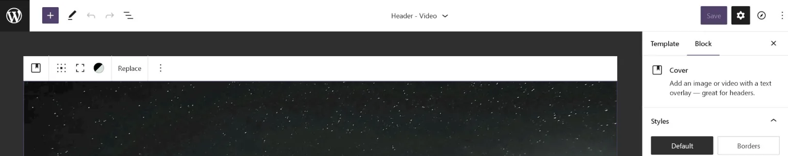

<table>
  <tr>
    <td></td>
    <td>
      <h1>Block Based Template Parts WordPress</h1>
      <p>Block Based Template Parts WordPress is the "name" column in the "wp_terms" table represented in the WordPress database records.</p>
    </td>
  </tr>
</table>

## Banner



## Screenshots


## Overview

Write a brief overview of your product here.

## Features

- Feature 1
- Feature 2
- Feature 3
- ...

## Requirements

Definition Javascript WordPress Theme Parts is the records.

## Instructions

"Header and Footer", which are block-based templating starter pages:

1. **Installation:** Added appropriately in "page.php".
2. **Activation:** Use your provided license key to activate the plugin and unlock its full potential.
3. **Exploration:** Dive into the intuitive interface, explore the features, and let your creativity run wild.

### Sub-section 1


1. **Setting the Groundwork:** Simply download the plugin from the official website or install it directly from your preferred IDE's marketplace.
```
Adding theme.json
<?php
add_action( 'after_setup_theme', 'tt1_block_parts_setup' );

function tt1_block_parts_setup() {
    add_theme_support( 'block-template-parts' );
}
```
2. **Go live in theme:** Open the theme’s header.php template and find this line of code.
```
<?php block_template_part( 'header' ); ?>
```
3. **Disabling template editor:** Use your provided license key to activate the plugin and unlock its full potential.
```
remove_theme_support( 'block-templates' );
```
4. **Using with Bootstrap:** Dive into the "Hero" interface, explore the features, and let your creativity run wild.

### Sub-section 2

Let’s add a theme.json file to the WordPress theme.

To do this, switch to a code editor like Visual Code Studio and create a new file in the root of the theme folder called theme.json.

Next use the curly braces to start a new JSON object, and add the $schema and version keys, and their respective values.

```
{
    "$schema": "https://schemas.wp.org/trunk/theme.json",
    "version": 2
}
```
If you refresh the page in the block editor, the first thing you’ll notice is that the editor content is slightly out of alignment.

```
{
    "$schema": "https://schemas.wp.org/trunk/theme.json",
    "version": 2,   
    "settings": {
        "layout": {
            "contentSize": "650"
        }
    }
}
```
This is because the by adding a theme.json to the theme, the default theme.json that ships with WordPress is now activated. That theme.json does not configure the settings.layout.contentSize setting, so you need to create it.
